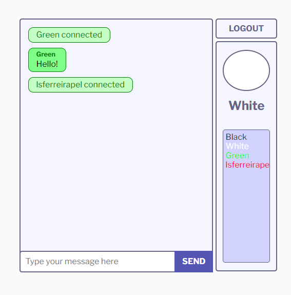

<h1 align="center">
  
  <p>Real time CHAT 💬</p>
</h1>

<h1>
  
</h1>

## 🧾 About


A simple real time chat, made in Node and using other cool tools.

## 🧰 Tools

- [Node](https://nodejs.org) 
- [Express](https://expressjs.com/)
- [Socket.io](https://socket.io/)
- [JWT](https://jwt.io/)
- [EJS](https://ejs.co/)


## 🔧 How to Setup

```bash
  # Clone the project
  $ git clone https://github.com/lsferreirapel/socket-chat-example.git
```
```bash
  # Enter directory
  $ cd socket-chat-example
```

```bash
  # Install the dependencies
  $ npm install
```
```bash
  # Run the project
  $ npm start

  #LOGS
  > socket-chat-example@0.0.1 start \socket-chat-example
  > node src/server.js
  🔥 Server linstening on port:3000
```


## 📝 License

This project is under the MIT license. See the file <a href="./LICENCE">LICENCE</a> for more details.

---

<p align="center">Made with 💙 by <a href="https://github.com/lsferreirapel">Lucas Ferreira</a></p>